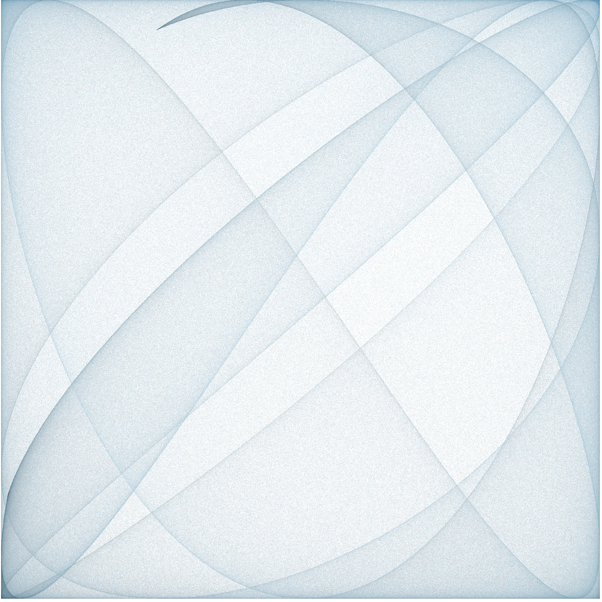

# math-art

Small collection of single-file, browser-based generative-art experiments.

## Spiral Knights

A turn-based pattern generator. Each color takes turns placing a "knight" (configurable K×K attack mask) on the lowest-numbered empty square of a counter-clockwise spiral-numbered N×N grid that is not attacked by a different color. Continues until no more pieces can be placed.

**▶ [Run it in your browser](https://jarredbarber.github.io/math-art/spiral-knights.html)**

Features:
- Configurable colors, board size, and move mask
- Preset masks (knight, king, plus, X, camel, space invader, …) or paint your own
- Progressive rendering with progress bar and stop button
- Pan / zoom (drag + scroll)
- Export to PNG (transparent background)
- State persisted in localStorage

Inspired by [this video](https://www.youtube.com/watch?v=UiX4CFIiegM).

## Cosine Map

A chaotic iterated-map renderer. Starting at (1,1,1), repeatedly applies
`(x,y,z) ← cos(M · (x,y,z))` for a random 3×3 matrix `M` and plots the trajectory. Different seeds yield wildly different attractors.

**▶ [Run it in your browser](https://jarredbarber.github.io/math-art/cosmap.html)**

Features:
- Density (HDR) and scatter rendering modes
- Seed input with a random button and curated "preferred seeds" presets
- Adjustable point count, canvas size, gamma/alpha, and color gradient
- Progressive render with progress bar and stop button
- Shows the generating matrix
- Pan / zoom, PNG export, localStorage persistence

A modern rewrite of a hand-coded HTML page I made years ago.

### Scale sweep (animation)

A companion page animates the matrix scale over time, so you can see how the attractor morphs as the cos arguments grow.

**▶ [Run it in your browser](https://jarredbarber.github.io/math-art/cosmap-anim.html)**

### What the pictures actually are

The point dynamics are fully chaotic — adjacent iterates have essentially zero correlation — so on any short timescale the orbit looks like noise. The structure you see emerges only after millions of samples: it's the **invariant measure** of the dynamical system, and the renderer is effectively doing Monte Carlo integration of it.



The image above was generated from this matrix:

```
[ 0.000  -8.783   5.855 ]
[ 0.000  -7.650   8.510 ]
[ 7.924   9.516  -8.923 ]
```

Two structural features explain what we're seeing:

- **x has no self-feedback**, and y doesn't depend on x either. So (y, z) is a closed 2D chaotic subsystem, and x is a deterministic function of the current (y, z): `x = cos(-8.783·y + 5.855·z)`. The 3D attractor lives on a 2D surface — the graph `x = f(y, z)` — embedded in [-1,1]³.
- The argument `-8.783·y + 5.855·z` ranges over an interval much larger than 2π, so cos folds it back on itself many times. Each fold becomes one of the overlapping arc bands in the (x, y) projection. The diamond / four-lobe symmetry comes from cos being even and periodic, with y appearing on both axes.

So the pretty arcs aren't a smooth curve being retraced — they're where the invariant density piles up because of the cos-folding Jacobian. This is also why more *points* matter more than more *pixels* when you're aiming for a clean print: you're refining a Monte Carlo estimate of a 2D density, not anti-aliasing a curve.
